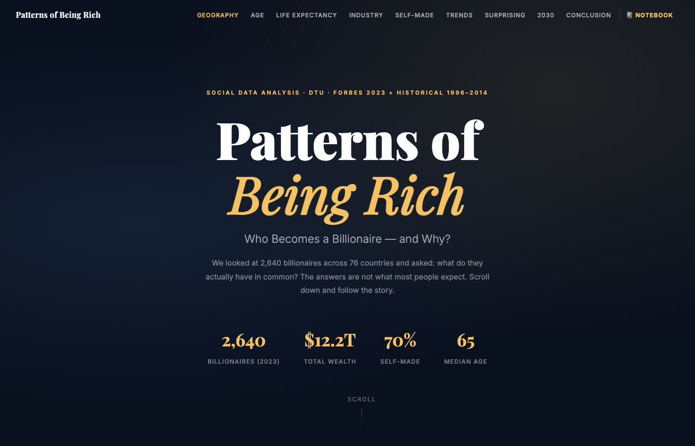
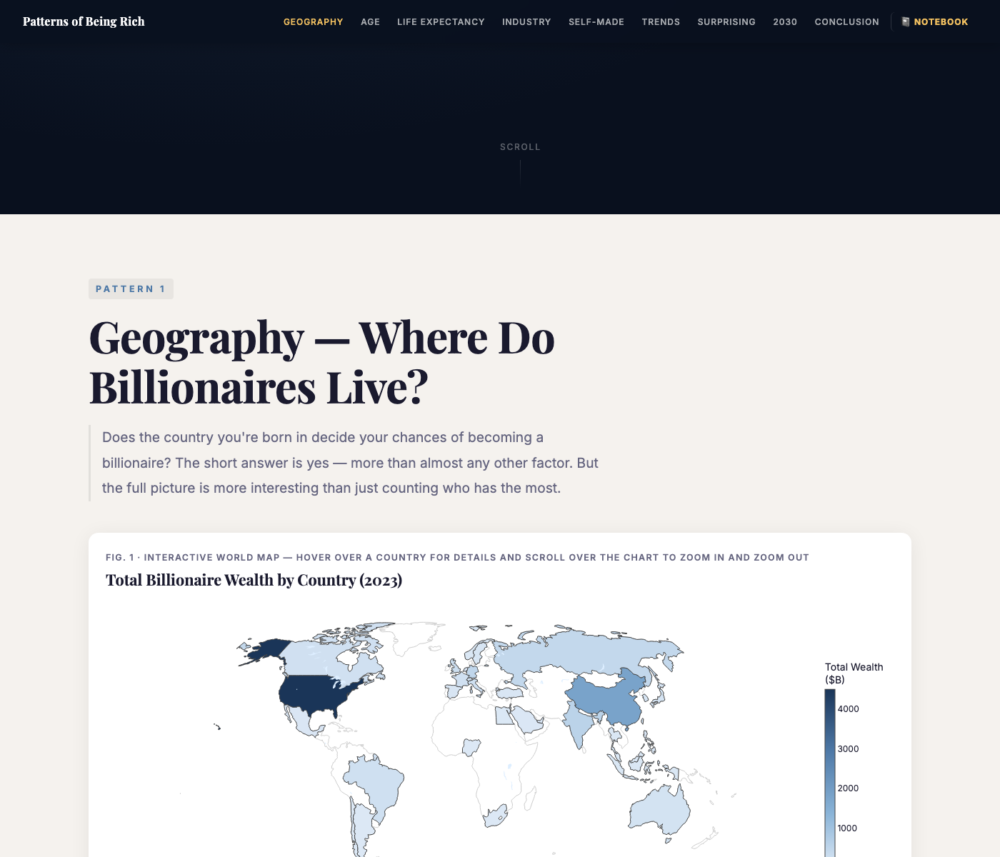
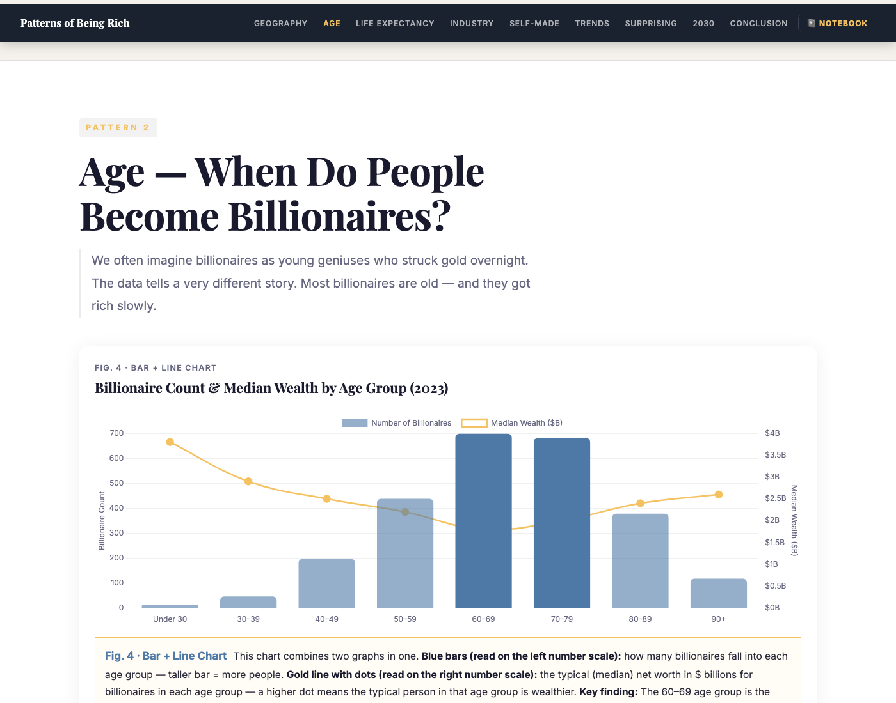
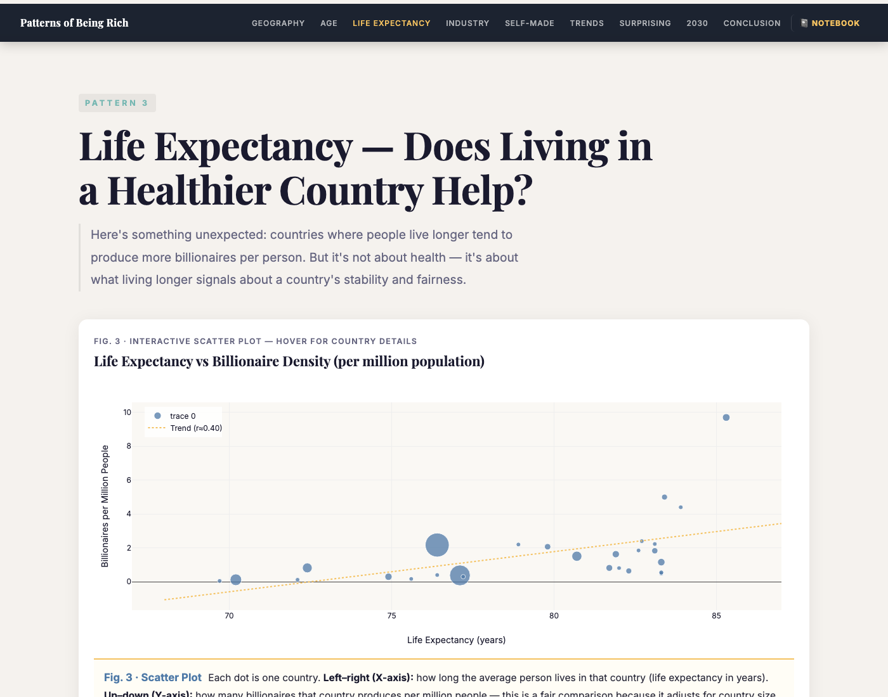
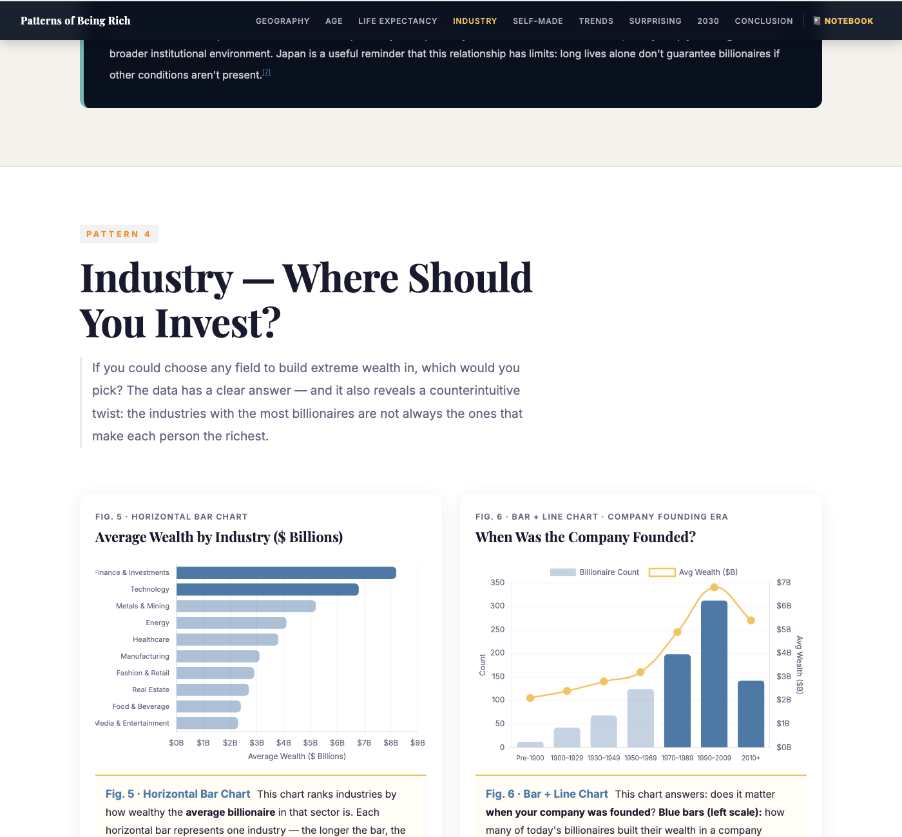
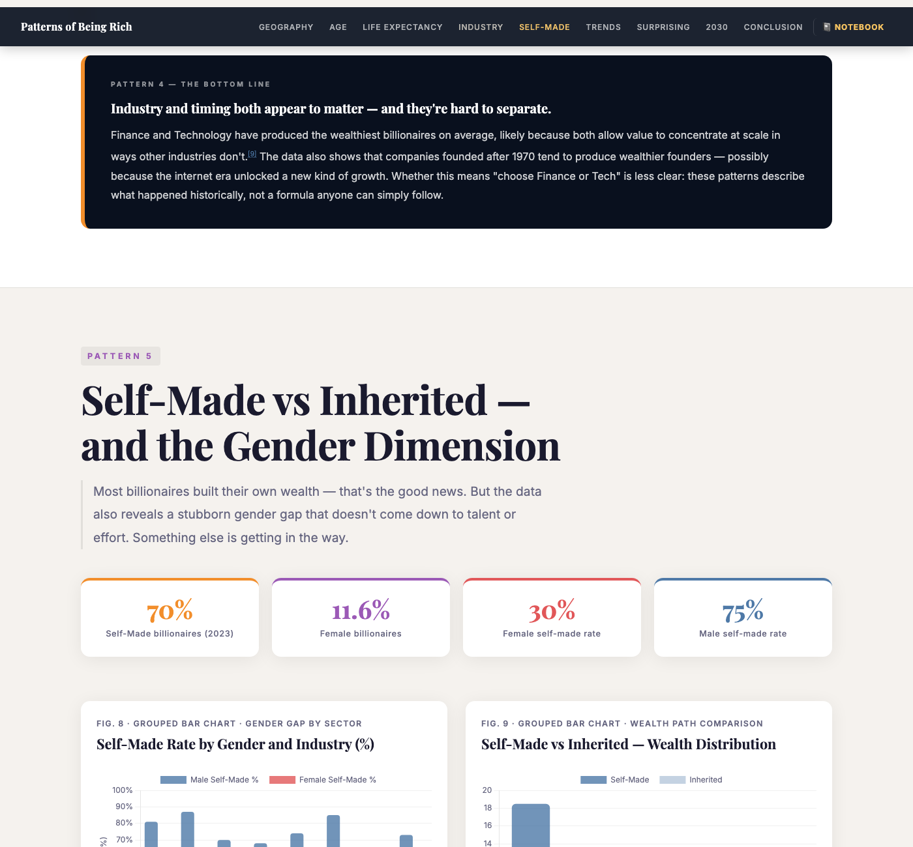
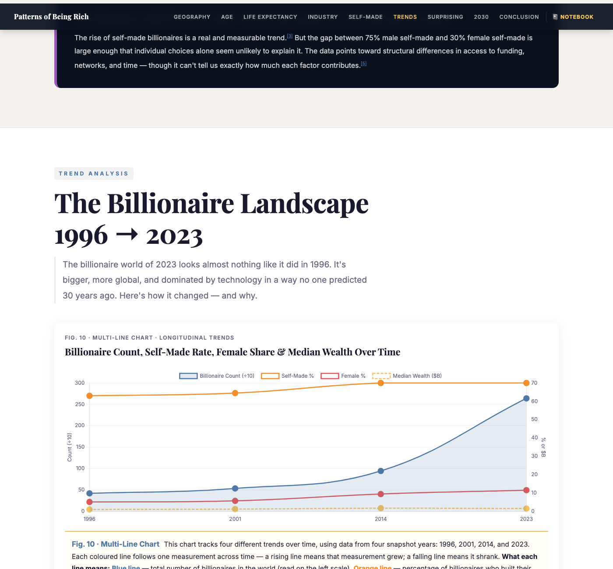
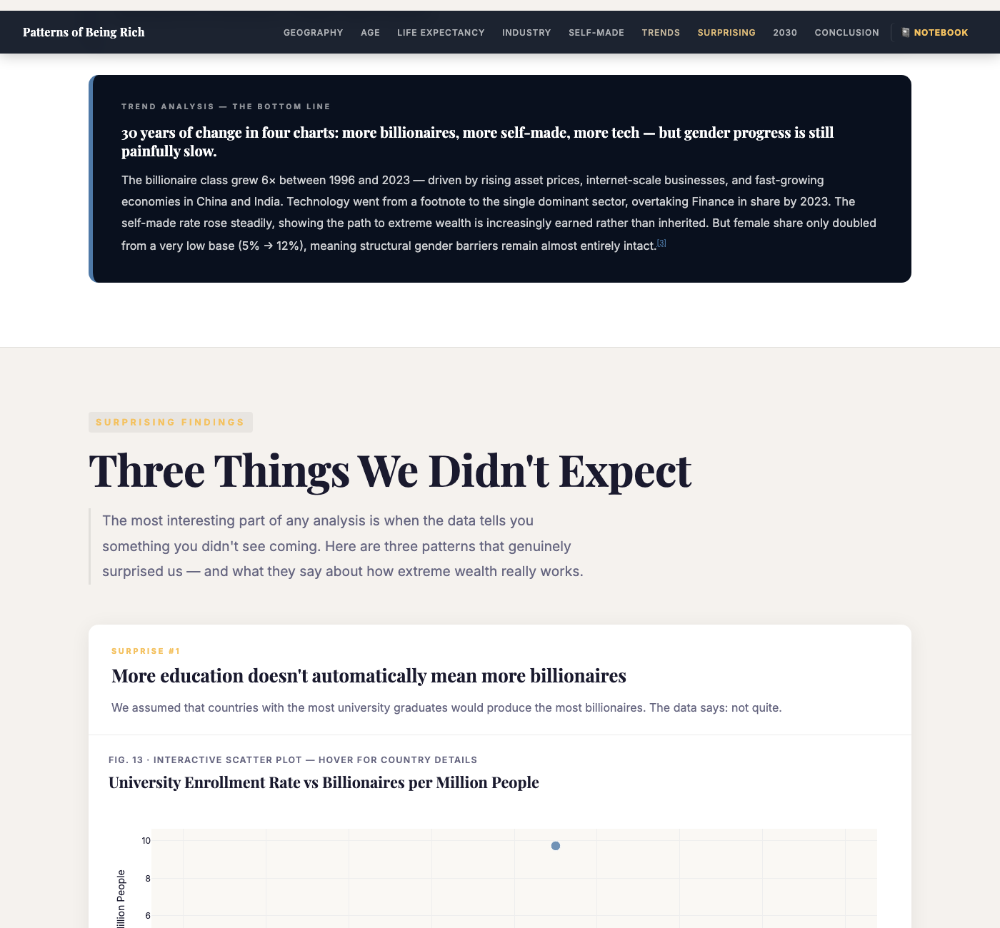
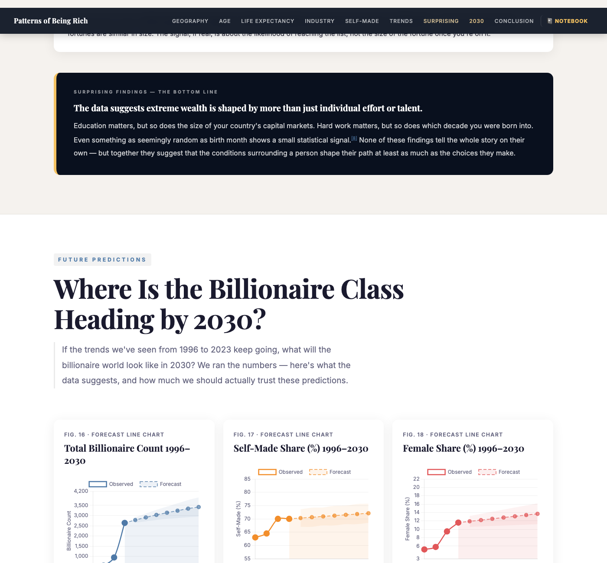

# Patterns of Being Rich — Who Becomes a Billionaire, and Why?

> A data-driven story about 2,640 billionaires across 76 countries and nearly 30 years of history.
> Built for **02806 Social Data Analysis and Visualization** at the Technical University of Denmark.



---

## Live Project

| Link | What it is |
|---|---|
| **[Interactive website](index.html)** | The narrative-driven story. Open `index.html` in any modern browser. |
| **[Explainer notebook](Final%20assignemnt.ipynb)** | The full analysis with code, methodology, and statistical detail. |

---

## What we asked

Most explanations of extreme wealth focus on individual effort or talent. We wanted to look at the data instead: across 2,640 billionaires, what do they actually have in common? Five questions guided the analysis:

1. **Geography** — Why are billionaires concentrated in just a few countries?
2. **Age** — Is there a typical age for becoming a billionaire?
3. **Life expectancy** — Does living in a stable, long-lived country matter?
4. **Industry** — Which sectors produce the wealthiest people?
5. **Self-made vs inherited** — And why is the gender gap still so large?

We then added three "surprising" investigations (education, internal inequality, birth month) and two machine-learning models (2030 forecasts + Random Forest classifier).

---

## The five patterns at a glance

### 1. Geography — wealth is concentrated in a few large economies



The US alone holds ~40 % of the world's billionaires. The correlation between country GDP and billionaire count is almost perfectly linear (r ≈ 0.98), but a handful of countries — India, Singapore, Hong Kong — break the pattern in revealing ways.

### 2. Age — most billionaires are in their 60s



The median age is **65**, and the violin plot shows that wealth within every age bracket is extremely right-skewed. Once you're on the list, age tells you almost nothing about how rich you are.

### 3. Life expectancy — stable institutions, not health



Countries where people live longer produce more billionaires per million people (r ≈ 0.40). The cause isn't health — life expectancy is a proxy for the kind of stable, well-functioning institutions that let wealth compound safely over decades.

### 4. Industry — finance is wealthiest, tech is fastest



Finance & Investments produces the highest average net worth (~$8.2 B). Technology is close behind and is the fastest-growing sector. A correlation heatmap and a "build / buy / inherit" comparison round out the picture.

### 5. Self-made vs inherited — and the stubborn gender gap



About 70 % of billionaires are self-made — but only **30 %** of female billionaires are, versus **75 %** of male billionaires. The gap reflects structural barriers in VC funding, networks, and caregiving — not differences in ambition.

---

## How things have changed (1996 → 2023)



The billionaire class grew 6× in 27 years, the self-made share crept up from 63 % to 70 %, and Technology went from a footnote to the dominant sector. Female share only doubled from a very low base.

---

## Three surprising findings



- **Education barely predicts billionaires.** Highly educated Nordic countries produce few of them; market size and capital depth matter more.
- **Inequality inside the billionaire class is extreme.** A Lorenz curve with Gini > 0.7 — higher than any country's income inequality.
- **Birth month shows a tiny but statistically significant signal** (chi-square *p* < 0.05) — consistent with the relative-age effect described by Malcolm Gladwell in *Outliers*.

---

## Forecasting to 2030



Polynomial regression with 95 % bootstrap confidence bands projects ~3,400 billionaires by 2030, a self-made share approaching ~72 %, and a female share still around ~14 %. A Random Forest classifier confirms that **industry** is the single strongest predictor of self-made status — more than country, age, or gender.

---

## The takeaway


Becoming a billionaire is shaped at least as much by where, when, and into what conditions you were born as by individual effort. The patterns are remarkably consistent: country institutions, scalable sectors, and structural access to capital recur across every analysis.

---

## How to run this project locally

```bash
# 1. Open the website (no server needed — pure static HTML)
open index.html

# 2. To run the notebook
pip install -r requirements.txt   # or install jupyter + pandas + sklearn + plotly
jupyter notebook "Final assignemnt.ipynb"
```

### Project structure

```
.
├── index.html                  # Interactive narrative website (the main deliverable)
├── Final assignemnt.ipynb      # Explainer notebook — code, methods, references
├── data/
│   ├── Billionaires Statistics Dataset.csv   # 2023 snapshot (Kaggle / Forbes)
│   └── billionaires.csv                      # Historical 1996–2014 (Peterson Inst.)
├── screenshots/                # Website previews used in this README
├── nandini.ipynb               # Teammate exploratory notebooks
├── nilanjana.ipynb
└── suhani.ipynb
```

---

## Methods

| Technique | Where it's used |
|---|---|
| Descriptive statistics + EDA | Throughout Patterns 1–5 |
| Pearson correlation matrix | Industry characteristics heatmap (Fig 7) |
| Lorenz curve + Gini coefficient | Inequality within the billionaire class |
| Chi-square goodness-of-fit | Birth-month test |
| Polynomial regression + bootstrap CIs | 2030 forecasts (count, self-made %, female %) |
| Random Forest classifier (5-fold CV) | Predicting self-made vs inherited |

---

## Design framework

The website follows the **Magazine Style** genre from Segel & Heer's *Narrative Visualization* framework (IEEE TVCG, 2010): a guided top-to-bottom narrative with interactive charts embedded inline.

A consistent color palette runs across every chart and caption:

| Colour | Reserved meaning |
|---|---|
| 🔵 Blue | counts, baseline category, "growing" |
| 🔴 Red | female gender (exclusively) |
| 🟠 Orange | self-made line / "shrinking" in diverging charts |
| 🟡 Gold | reference / expected / trend / ceiling lines |
| 🩵 Teal | Pattern 3 (life expectancy) section accent |
| 🟣 Purple | Pattern 5 (self-made & gender) section accent |

---

## Authors

Group project for **02806 — Social Data Analysis and Visualization**, DTU.

- **Suhani Pandey** — website, design & narrative, integration
- **Nandini** — EDA, industry & inheritance analyses
- **Nilanjana** — education analysis, scatter plots

---

## References

Full reference list with inline citations is in §7 of [`Final assignemnt.ipynb`](Final%20assignemnt.ipynb) and at the bottom of the [website](index.html). Key sources: Segel & Heer (2010), Piketty & Saez (2013), Stiglitz (2012), Kaplan & Rauh (2013), Gladwell (2008), plus the Forbes 2023 dataset and World Bank Development Indicators.
